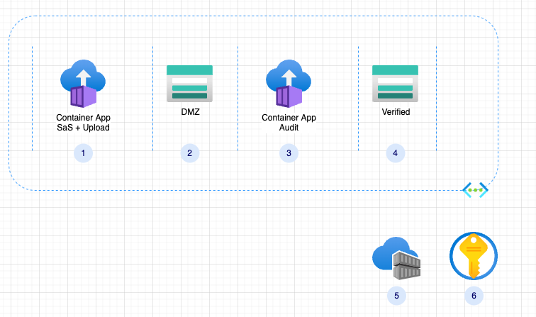

# file-service-sample

## User story

(revise as real user story?)
As a service providers, you require or use files uploaded by your customers. You are aiming for a secured, easy to maintain micro-service, that would be used either as an API or as a UI service.

## Design Approach

I took these guidlines when initialy approached the solution:

- Network Seperation
- Time, role and IP based authorization
- Microservice

Here is the draft architecture created:


### Components

> To Do: add network security components and description

1. Container App - create SaS tokens and containers

2. Storage Account - DMZ, all content is considered unsafe

3. Container App - verify content and move it to verified storage

4. Verified storage, content is assumed to be verified and has minimal or no threat to the organization

5. Container Registry - holds the container app images

6. Azure KeyVault - holds connection strings and other secured configuration

### Flow

>To DO: missing authentication

1. Caller^1^ make a call to obtain a SaS token for a container^2^

2. ContainerApp, extracts the caller IP, creates the token, and return it to the caller

3. Caller uses the token to upload new file to the container in the DMZ storage

4. Second container app, validates the file uploaded is valid/clean and moves it to a verified storage account

^1^ - A caller is an authorized application, user or any other identity, the project has few sample clients that are able to leverage the provided APIs, it is an implementation decsion which client to use.

^2^ - There are two options, either the caller provided an exisiting container name, or he can create a new one.

> Note: The scope of this project does not address how the content is validated/verified/cleaned.

## Main Design Considerations

- Secured, the code must hosted in vnet enabled compute.
- Youd storage must not be publicly exposed.
- All uploads are considered unsafe unless verified.
- Customer uploads must land on DMZ storage, with minimal, automatic clean up.

## File Server

We provide two main end points, if the client did not create yet a designated container, he can call the `api/SaSToken` this will create a container with GUID as the name, and return a SaS token for that container. It is expected that the client will reuse this container in any consequtive calls. It will be implemented a validation for this.

### Request

The request can contain the designated container name, or if one is not passed, one would be created.

Here are two examples, the first is using a created container name, the second is requesting to create one.

```curl
curl -X 'GET' \
  'https://fileserver.grayriver-46b04276.northeurope.azurecontainerapps.io/api/SaSToken/f7b969a1-e800-424a-b9c1-ab6f94e49b6d' \
  -H 'accept: text/plain'
```

```curl
curl -X 'GET' \
  'https://fileserver.grayriver-46b04276.northeurope.azurecontainerapps.io/api/SaSToken' \
  -H 'accept: text/plain'
```

#### test.rest

As part of this repo, I've included the [rest.test](./clients/rest/test.rest) to help test uploading content to the DMZ storage.
You will need to create an `.env` file with these entries, both are provided with in the response of the Token API.

```.env
sas_base_url=<SasTokenBaseUri>
sas_sig=<SasTokenSig>

```

### Response

As part of the response, the full URI is provided together with the captured IP, the container name and also the breakdown of the URI which might be needed for few clients.

Here is a sample response:

```json
{
    "ContainerName":"xxx969a1-e800-424a-b9c1-ab6f94e49xxx",
    "RemoteIp":"XX.XXX.XX.XXX",
    "RequestStatus":"Success",
    "SaSUri":"https://xxxxxxx.blob.core.windows.net/f7b969a1-e800-424a-b9c1-ab6f94e49b6d?sv=2021-08-06&se=2022-09-05T14%3A17%3A51Z&sip=xx.xxx.xx.xxx&sr=c&sp=racwdxyltmei&sig=XXXXXXX",
    "SasTokenBaseUri":"https://xxxxxxx.blob.core.windows.net/f7b969a1-e800-424a-b9c1-ab6f94e49b6d","SasTokenSig":"sv=2021-08-06&se=2022-09-05T08%3A24%3A10Z&sip=xx.xxx.xx.xxx&sr=c&sp=racwdxyltmei&sig=XXXXXXX"
}
```
